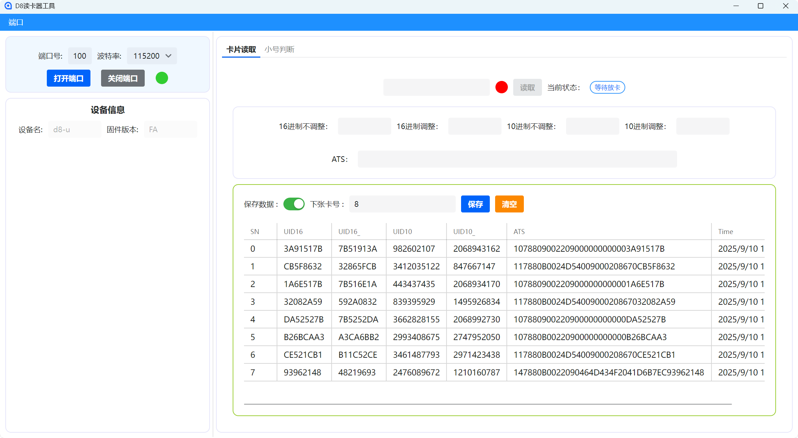

# 智能卡工具程序

## 支持的功能：

|    功能    | 支持 |
|:--------:|:--:|
| CPU卡信息读取 | ✔️ |
| CPU卡信息保存 | ✔️ |
|  卡片类型判断  | ✔️ |
| M1卡信息读取  | ✔️ |
| M1卡密钥验证  | ✔️ |
| M1卡内容写入  | ❌  |

## 截图

## 系统要求

- .Net 9.0 以上
- Window 10 以上
- RAM > 4 GB

## 注意事项

- 如果需要保存数据库功能，需额外安装Access Database Engine。
- 本程序默认支持64位计算机，32位计算机需自行更换32位的dcrf32.dll。
